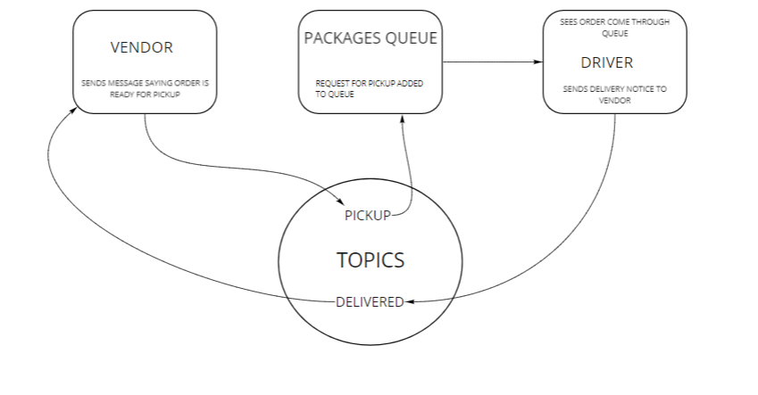

# CAPS CLOUD

Author: Katy Roffe

## About

Using only AWS Services: SQS, SNS, Lambda, create a cloud version of the CAPS system.

This is designed to mimic a real-time service to allow:

  - Vendors to alert a system of a package to be delivered
  - Drivers to see what is in their pickup queue
  - Drivers to alert vendors when the delivery has occurred

## Requirements

### **Services**

- SNS Topic: pickup which will receive all pickup requests from vendors
- SQS Queue (FIFO): packages which will contain all delivery requests from vendors, in order of receipt.
  - Subscribe this queue to the pickup topic so all pickups are ordered
- SQS Queue (Standard) for each vendor (named for the vendor) which will contain all delivery notifications from the drivers

### **Operations**

**Vendors:**

- Vendors will post “pickup” messages containing delivery information into the SNS pickup topic
  - `{ orderId: 1234, customer: "Jane Doe", vendorId: queueArn}`  
  - Note the queueArn – this refers to the AWS ‘arn’ of the vendor’s specific delivered queue
- Pickup requests should be moved into a FIFO queue called packages for the drivers automatically
  - Make the packages queue a subscriber to the pickup topic
- Vendors should separately subscribe to their personal SQS queue and periodically poll the queue to see delivery notifications

**Drivers:**

- Drivers will poll the SQS packages queue and retrieve only the next delivery order (message)
- After a time (e.g. 5 seconds), drivers will post a message to the Vendor specific SQS Queue using the queueArn specified in the order object

## UML

